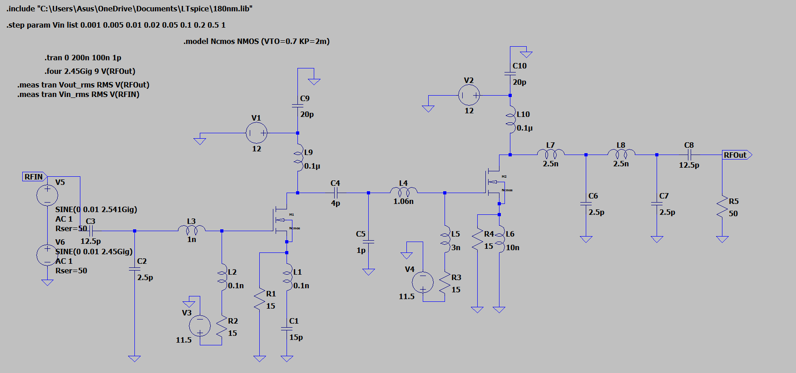

# 2.45 GHz MOS RF Amplifier

A two-stage Class-A NMOS RF Power Amplifier designed and simulated in LTspice for 2.45 GHz RFID applications.

---

## Overview

This project implements a two-stage common-source RF power amplifier operating in the 2.45 GHz ISM band. The amplifier is designed for use in RFID reader systems and is simulated using LTspice with a simple NMOS transistor model.

- **Topology:** Two-stage common-source (Class-A)
- **Frequency:** 2.45 GHz
- **Technology:** NMOS (VTO = 0.7V, KP = 2m)
- **Supply Voltage:** 12V
- **Load:** 50Ω
- **Simulator:** LTspice

---

## Schematic



The circuit consists of:
- **Input matching network** — C3 (12.5p), C2 (2.5p), L3 (1n) to match 50Ω source at 2.45 GHz
- **Stage 1 (M1)** — NMOS common-source amplifier with gate bias V3 = 11.5V, drain supply V1 = 12V
- **Interstage matching network** — C4 (4p), L4 (1.06n) tuned to resonate at 2.45 GHz
- **Stage 2 (M2)** — NMOS common-source amplifier with gate bias V4 = 11.5V, drain supply V2 = 12V
- **Output matching network** — L7 (2.5n), L8 (2.5n), C8 (12.5p) into 50Ω load (R5)

---

## Transistor Model

Located in the `MOS Model/` folder.

```spice
.model Ncmos NMOS (VTO=0.7 KP=2m)
```

KP = 2m gives a transconductance of approximately 18.6 mA/V, which provides sufficient gain at 2.45 GHz.

---

## Simulation Setup

The following directives are used in the schematic:

```spice
.tran 0 200n 100n 1p
.step param Vin list 0.001 0.005 0.01 0.02 0.05 0.1 0.2 0.5 1
.four 2.45Gig 9 V(RFOut)
.meas tran Vout_rms RMS V(RFOut)
.meas tran Vin_rms  RMS V(RFIN)
```

The `.step` directive runs 9 separate simulations, one for each input amplitude (1mV to 1V). This is used to observe gain compression and find the P1dB point.

---

## Output Results

All simulation results are in the `Output/` folder.

### Vout and Vin RMS Step Analysis


This image shows the RMS voltage of the output (`V(RFOut)`) and input (`V(RFIN)`) across all 9 simulation steps.

To get output power in dBm from the RMS values, use:

```
Pout (dBm) = 10 * log10( Vout_rms² / 50 / 0.001 )
```

Each of the 9 steps corresponds to a different input power level. Reading these values shows how the output power and gain change as the input increases — this is how the P1dB compression point is identified.

| Step | Vin Amplitude | Region |
|------|--------------|--------|
| 1–3  | 1 mV – 10 mV  | Linear (clean sine wave output) |
| 4–6  | 20 mV – 100 mV | Mild compression begins |
| 7–9  | 200 mV – 1 V  | Saturation / heavy clipping |

### Fourier Harmonic Analysis

The `.four` directive outputs a harmonic distortion report in the LTspice error log (`Ctrl+L`). Results show:

- **Total Harmonic Distortion (THD): 1.64%** — good linearity for a Class-A amplifier
- Fundamental component at 2.45 GHz dominates cleanly

---
